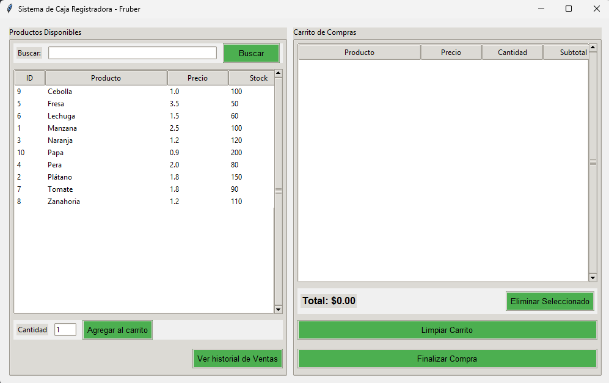
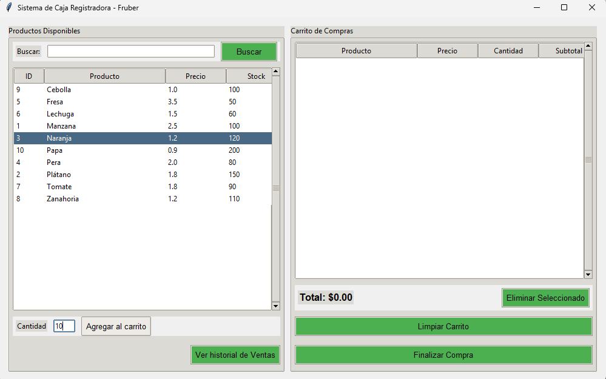
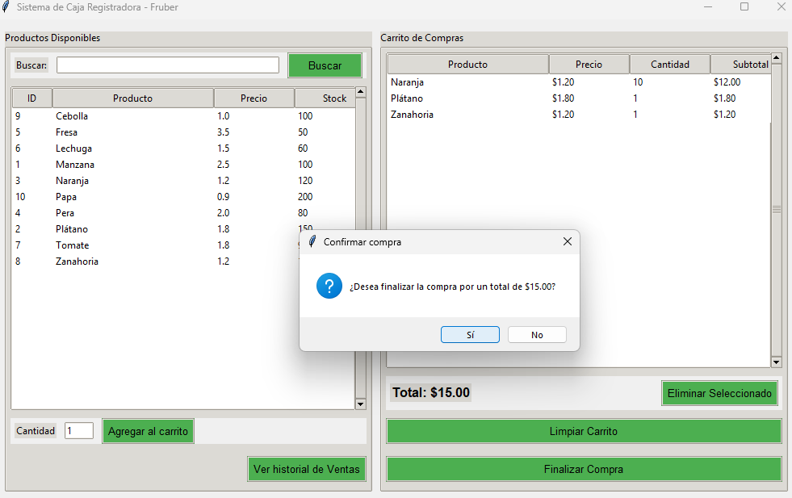
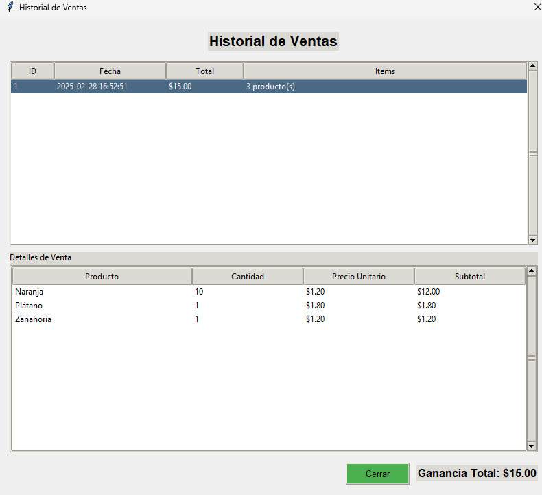

# Fruber - Sistema de Caja Registradora

Un sistema completo de caja registradora para la tienda Fruber implementado siguiendo el patrón MVC (Modelo-Vista-Controlador) y utilizando SQLite para la persistencia de datos.




## 🧰 Características Principales

- Gestión completa de productos (visualización, búsqueda, control de stock)
- Sistema de carrito de compras interactivo
- Registro y persistencia de ventas
- Historial detallado de transacciones
- Interfaz gráfica intuitiva con Tkinter

## 🏗️ Arquitectura

El sistema está desarrollado siguiendo el patrón MVC para mantener una estructura organizada y escalable:

### Patrones de Diseño Implementados

1. **Modelo-Vista-Controlador (MVC)**:
   * **Modelo**: Gestiona los datos y la lógica del negocio (`models/`)
   * **Vista**: Muestra la interfaz gráfica al usuario (`views/`)
   * **Controlador**: Coordina el modelo y la vista (`controllers/`)

2. **Singleton**: 
   * Implementado en `DatabaseManager` para garantizar una única instancia de conexión a la base de datos.

3. **Observer**: 
   * Utilizado entre el controlador de ventas y la vista del carrito para notificar cambios.

4. **Factory Method**: 
   * Para crear diferentes tipos de elementos en la interfaz de usuario.

## 💾 Estructura de Base de Datos

La base de datos SQLite tiene tres tablas principales:

- **productos**: Almacena información de productos (id, nombre, precio, stock)
- **ventas**: Registra las ventas (id, fecha, total)
- **detalle_ventas**: Guarda los detalles de cada venta (productos, cantidades, precios)

## ✨ Funcionalidades Implementadas

### Gestión de Productos
- Visualización de productos disponibles
- Búsqueda de productos por nombre
- Control automático de stock

### Gestión de Ventas
- Carrito de compras interactivo
- Cálculo automático de totales
- Finalización de compras con actualización de stock
- Persistencia de las ventas en la base de datos

### Historial de Ventas
- Visualización del historial completo
- Detalles de cada venta
- Cálculo de ganancias totales

### Manejo de Excepciones
- Control de stock insuficiente
- Validación de cantidades
- Manejo de errores durante la compra

## 🚀 Instalación y Ejecución

### Requisitos Previos
- Python 3.8 o superior
- Tkinter (generalmente viene preinstalado con Python)

### Pasos para Ejecutar
1. Clona este repositorio:
   ```bash
   git clone https://github.com/JoseBalbuena181096/Reto_3_DevSenior.git
   cd Reto_3_DevSenior
   ```

2. Asegúrate de tener la estructura de carpetas correcta:
   ```
   Reto_3_DevSenior/
   ├── main.py
   ├── models/
   │   ├── __init__.py
   │   ├── database.py
   │   ├── producto.py
   │   └── venta.py
   ├── views/
   │   ├── __init__.py
   │   ├── main_view.py
   │   ├── carrito_view.py
   │   └── historial_view.py
   └── controllers/
       ├── __init__.py
       ├── producto_controller.py
       └── venta_controller.py
   ```

3. Ejecuta el sistema:
   ```bash
   python main.py
   ```

El sistema automáticamente creará la base de datos SQLite y la poblará con productos iniciales la primera vez que se ejecute.

## 🧪 Capturas de Pantalla






## 👥 Contribuciones

Las contribuciones son bienvenidas. Por favor abre un issue primero para discutir lo que te gustaría cambiar o añadir.

1. Haz un Fork del proyecto
2. Crea tu rama de característica (`git checkout -b feature/AmazingFeature`)
3. Haz commit de tus cambios (`git commit -m 'Add some AmazingFeature'`)
4. Haz Push a la rama (`git push origin feature/AmazingFeature`)
5. Abre un Pull Request
## Autor ✒️

- **José Ángel Balbuena Palma** - *Desarrollo Inicial*
-  Ver video de funcionamiento  [AQUÍ](https://www.youtube.com/watch?v=711KrOxIIcA) 

## Licencia 📄

Este proyecto está bajo la Licencia [MIT](https://opensource.org/licenses/MIT) - mira el archivo LICENSE.md para detalles

## Agradecimientos 💎

- A todos los que usen y mejoren este código
- A la comunidad de desarrolladores Python

---
⌨️ con ❤️ por [José Ángel Balbuena Palma](https://github.com/JoseBalbuena181096) 😊